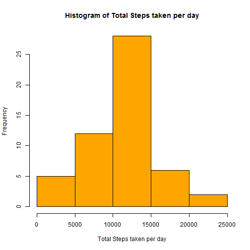
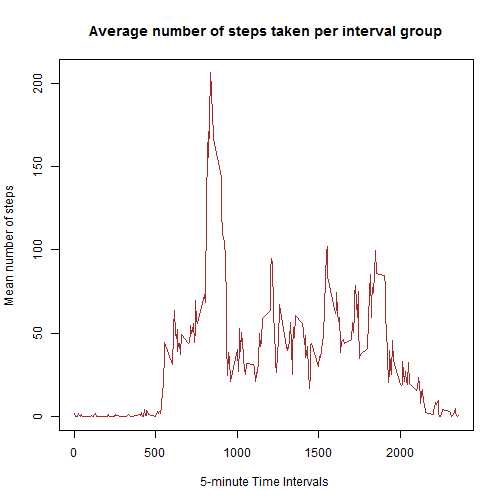
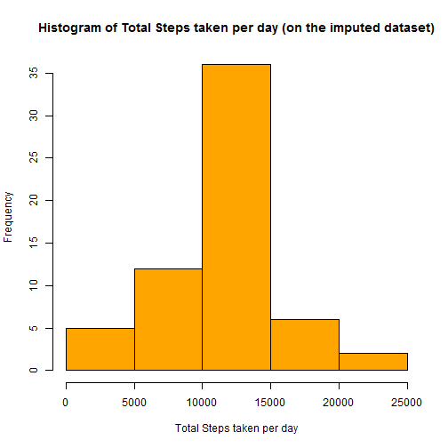

PA1_template 
===============================
loading libararies...

```r
knitr::opts_chunk$set(echo=TRUE)
library(dplyr)
library(lattice)
library(lubridate)
```

###1 Loading and processing the data

This dataset includes the number of steps taken in 5 minute intervals each day over a period of two months.
 
 **1.1 Load the data from "activity.csv"**
 
 First, we read the data and load it to a variable (ofcourse, the WD has to be set to the location where the .csv is located)
 

```r
dataACT<-read.csv("activity.csv")
```

 **1.2 Change the type of the "date" column to Date type and group the data by date**
 
 Now we convert the date column to the Date format :

```r
dataACT$date<-as.Date(dataACT$date,"%Y-%m-%d")
```


###2 What is mean total number of steps taken per day?

 **2.1 Calculate the total number of steps taken a day.**
 
 First, we use **dplyr** package to group the dataset by dates and calculate the total number of steps per day :

```r
by_data<-dataACT %>% group_by(date)
head(by_data)
```

```
## # A tibble: 6 x 3
## # Groups:   date [1]
##   steps       date interval
##   <int>     <date>    <int>
## 1    NA 2012-10-01        0
## 2    NA 2012-10-01        5
## 3    NA 2012-10-01       10
## 4    NA 2012-10-01       15
## 5    NA 2012-10-01       20
## 6    NA 2012-10-01       25
```

```r
s<-aggregate(steps~date,by_data,sum,na.rm = TRUE )
head(s)
```

```
##         date steps
## 1 2012-10-02   126
## 2 2012-10-03 11352
## 3 2012-10-04 12116
## 4 2012-10-05 13294
## 5 2012-10-06 15420
## 6 2012-10-07 11015
```


**2.2 Calculate the mean and median of the total number of steps taken per day**
 
 Now we calculate the mean and median number of daily steps:
 

```r
s_mean<-mean(s$steps)
s_median<-median(s$steps)
```


The mean of the total number of steps taken a day is 1.0766189 &times; 10<sup>4</sup> and the median of total number of steps taken a day is 10765.


 **2.3 The histogram of the total number of steps taken a day is as follows:**
 
 Since we have calculated the total number of steps taken a day, we can construct the histogram of the total steps taken a day using the base plot system:
 

```r
hist(s$steps,col="orange",main="Histogram of Total Steps taken per day",xlab="Total Steps taken per day",cex.axis=1,cex.lab = 1)
```




##3 What is the average daily activity pattern?

In this section, we categorize the dataset per interval groups. That way, we can calculate the average daily pattern for all the days and understand what time of the day has the person been most active and least active.


**3.1 Make a time series plot (i.e. type = "l") of the 5-minute interval (x-axis) and the average number of steps taken, averaged across all days (y-axis)**

We can calculate the mean number of steps of each interval group:


```r
by_data_mean<-aggregate(steps~interval,data=dataACT,FUN=mean,na.rm=TRUE)
```

We then plot a line graph of the mean numebr of steps of each interval group across all days:


```r
plot(by_data_mean$interval,by_data_mean$steps,type='l', xlab = "5-minute Time Intervals ", ylab = "Mean number of steps ", main = "Average number of steps taken per interval group",  col = "brown")
```



Looking at the plot we can observe that the largest number of steps occur between the interval 750 and 1000. In the next section we will see what is the interval that has maximum number of steps.


**3.2 Which 5-minute interval, on average across all the days in the dataset, contains the maximum number of steps?**

We can use **which.max** command to get the answer:

```r
by_data_mean[which.max(by_data_mean$steps),"interval"]
```

```
## [1] 835
```

The interval group, #835 has the maximum average numebr of steps of 206.1698113 across all days recorded in the dataset.


##4 Imputing missing values

**4.1 Calculate and report the total number of missing values in the dataset (i.e. the total number of rows with NAs)**

We know that there are missing values(steps) in the dataset. The following will calculate the total number of rows that contain an NA.


```r
sum(!complete.cases(dataACT))
```

```
## [1] 2304
```

The total number of missing values in the dataset are 2304.


**4.2 Devise a strategy for filling in all of the missing values in the dataset. The strategy does not need to be sophisticated. For example, you could use the mean/median for that day, or the mean for that 5-minute interval, etc.**

The missing step values belong to an interval group, like interval group 0, 5, 10 etc. The strategy that is devised here is to use the average number of steps per interval group to fill in the NAs that belong that that interval group. 

In the next section, you will see how that can be achived.
        
        
        
**4.3 Create a new dataset that is equal to the original dataset but with the missing data filled in**

Copied the original dataset stored in **dataACT** in to a new variable :


```r
c_data<-dataACT
```


The following lines would:

- go through the entire dataset

- wherever, the steps value is NA- it would replace NA with the mean number of steps taken at that interval

-    For example, if there is an 'NA' and its interval is 5. The 'NA' would be replaced by mean number of steps for the interval 5.


```r
for (i in 1:nrow(c_data)) {
  if (is.na(c_data[i,"steps"])) {
    c_data[i,"steps"] <- by_data_mean$steps[by_data_mean$interval ==    c_data$interval[i]]
                }
    }
```


The dataset stored in **c_data** has the NAs replaced.

**4.4 Make a histogram of the total number of steps taken each day and Calculate and report the mean and median total number of steps taken per day. Do these values differ from the estimates from the first part of the assignment? What is the impact of imputing missing data on the estimates of the total daily number of steps?**


```r
hist(aggregate(steps~date,c_data,sum)$steps,col="orange",main="Histogram of Total Steps taken per day (on the imputed dataset)",xlab="Total Steps taken per day",cex.axis=1,cex.lab = 1)
```




The mean of the imputed dataset is 1.0766189 &times; 10<sup>4</sup>. 

The mean of the imputed dataset is same as the mean original dataset 1.0766189 &times; 10<sup>4</sup>.

The median of the imputed dataset is 1.0766189 &times; 10<sup>4</sup>. The median value of the imputed dataset has changed compared to the original  median 10765.


###5 Are there differences in activity patterns between weekdays and weekends?

**5.1 Create a new factor variable in the dataset with two levels - "weekday" and "weekend" indicating whether a given date is a weekday or weekend day.**


*wday()* function from the **lubridate** package was used to assign day names to the dates in the dataset. And a new column *dayName* was created to label *Saturday* and *Sunday*  as *weekend* and rest of the days as *weekday*. 


```r
for (i in 1:nrow(c_data)) {
        c_data$dayName[i]<-ifelse(wday(as.Date(c_data$date[i]),label=TRUE) %in% c("Sat","Sun"),"weekend","weekday")
        }
```


The column dayName type is converted to be a factor type.


```r
c_data$dayName<-as.factor(c_data$dayName)

head(c_data)
```

```
##       steps       date interval dayName
## 1 1.7169811 2012-10-01        0 weekday
## 2 0.3396226 2012-10-01        5 weekday
## 3 0.1320755 2012-10-01       10 weekday
## 4 0.1509434 2012-10-01       15 weekday
## 5 0.0754717 2012-10-01       20 weekday
## 6 2.0943396 2012-10-01       25 weekday
```


**5.2 Make a panel plot containing a time series plot (i.e. type = "l") of the 5-minute interval (x-axis) and the average number of steps taken, averaged across all weekday days or weekend days (y-axis). See the README file in the GitHub repository to see an example of what this plot should look like using simulated data.**


```r
c_data_mean= aggregate(steps ~ interval + dayName, c_data, mean)
xyplot(steps ~  interval|factor(dayName) , data = c_data_mean, aspect =1/2,
type = "l")
```


Looking at the plots , one can say the activity is distributed across the day over the weekends when compared to weekdays. One can assume, that when number of steps are less than 20 the person is sleeping. Based on that assumption, one can say the person sleeps more during weekends.
